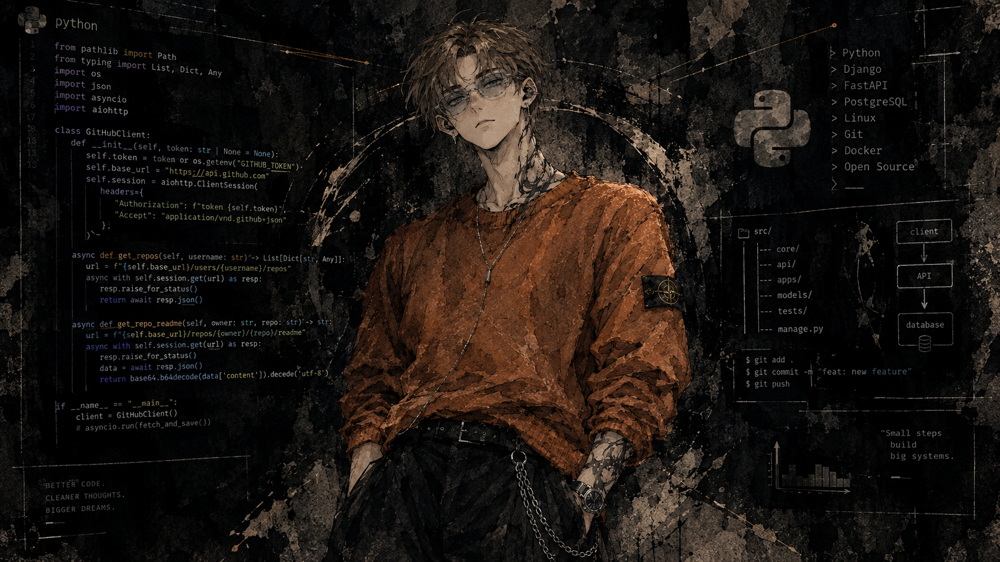

  

   

  <h1>Ivan Levitsky</h1>

  

    <strong>23 y.o. Python Backend Developer</strong>
  

  

    <code>Python</code> · <code>Django</code> · <code>FastAPI</code> ·
    <code>Docker</code> · <code>Linux</code>
  

  

    
  

---

  <h2>╭─ About Me ─╮</h2>

<table>
<tr>
<td width="55%" valign="top">

### 👋 Hello, World!

I'm **Ivan Levitsky**, a Python Backend Developer from **Minsk, Belarus**, with around **3 years of experience** building backend applications, APIs, automation tools, and services that solve practical problems.

My main focus is:

- 🐍 Python
- 🌐 Django & FastAPI
- 🤖 Telegram bots
- 🐳 Docker & Linux
- ⚙️ Backend architecture
- 🔧 System-level tooling

I enjoy working close to the system — from writing application logic to configuring Linux, managing containers, and building the infrastructure that keeps everything running.

</td>

<td width="45%" valign="top" align="center">

</td>
</tr>
</table>

---

  <h2>╭─ Current Project ─╮</h2>

<table>
<tr>
<td width="15%" align="center">

🎞️

</td>
<td width="85%">

### Self-Hosted Media Platform

Currently building a **self-hosted media platform for hosting videos and books**.

The goal is simple:

> Useful software. Understandable architecture. Complete control.

A project focused on backend development, media management, infrastructure, and self-hosting.

</td>
</tr>
</table>

---

  <h2>╭─ Tech Stack ─╮</h2>

   

  

---

  <h2>╭─ Philosophy ─╮</h2>

   

  <blockquote>
    <i>
      "What doesn't kill you evolves and tries again.
       
      This phenomenon got its name — HR."
    </i>
  </blockquote>

---

  

    

  
    Built with Python, caffeine, and a questionable amount of Docker containers.
  

